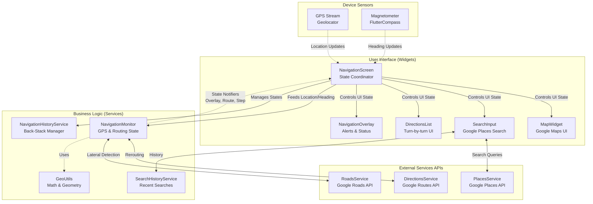

# PII Navigation App - Architettura e Flusso di Processo (BPMN)

Questo documento presenta:
1. Il **Diagramma a Blocchi** (Architettura del Sistema) che mostra come interagiscono i vari componenti, servizi e widget.
2. Il processo **BPMN** (rappresentato tramite flowchart) che illustra la logica di funzionamento passo dopo passo, dalla ricerca della destinazione fino alla navigazione e arrivo.

---

## 1. Diagramma a Blocchi (Architettura del Sistema)

La nostra applicazione è basata su Flutter. Il `NavigationScreen` funge da punto di coordinamento principale, collegando i Widget visivi della UI con i Servizi logici che chiamano le API esterne e il dispositivo (GPS / Bussola).



---

## 2. Diagramma BPMN (Logica di Navigazione e Processi)

Il diagramma sottostante modella l'interazione utente e la logica interna del `NavigationMonitor` (il ciclo di navigazione) utilizzando le convenzioni visive del BPMN (Cerchi per Inizio/Fine, Rettangoli per Attività, Rombi per i Decision Gateways).

```mermaid
flowchart TD
    %% Styling per nodi BPMN simulati
    classDef startEvent fill:#8f8,stroke:#333,stroke-width:2px,shape:circle
    classDef endEvent fill:#f88,stroke:#333,stroke-width:4px,shape:circle
    classDef gateway fill:#fd8,stroke:#333,stroke-width:2px,shape:diamond
    classDef task fill:#dae8fc,stroke:#6c8ebf,stroke-width:1px
    classDef systemTask fill:#d5e8d4,stroke:#82b366,stroke-width:1px

    Start(("Inizio<br>Avvio App")) ::: startEvent
    End(("Fine<br>Navigazione")) ::: endEvent

    %% === Fase Preparazione ===
    S_Search["L'utente inserisce una<br>destinazione nel SearchInput"] ::: task
    S_SelectPlace["L'utente seleziona un Luogo"] ::: task
    G_Directions{"Visualizzazione<br>Percorso?"} ::: gateway
    S_API_Routes["Directions API<br>Calcola il percorso"] ::: systemTask
    S_RoutePreview["Mostra Anteprima Percorso<br>sulla mappa"] ::: task

    Start --> S_Search
    S_Search --> S_SelectPlace
    S_SelectPlace --> G_Directions
    G_Directions -->|"Utente fa tap su<br>'Indicazioni'"| S_API_Routes
    S_API_Routes --> S_RoutePreview

    %% === Fase Navigazione ===
    G_StartNav{"Utente preme<br>'Avvia'?"} ::: gateway
    S_InitNav["Avvio Navigation Monitor<br>e fix Camera GPS"] ::: systemTask
    
    S_RoutePreview --> G_StartNav
    G_StartNav -->|Sì| S_InitNav

    subgraph Navigation Loop [Ciclo di Aggiornamento GPS]
        direction TB
        L_GPS["Ricezione Aggiornamento GPS<br>Posizione, Velocità, Direzione"] ::: systemTask
        G_Arrival{"Destinazione<br>Raggiunta?"} ::: gateway
        S_Celebrate["Mostra Bottom Sheet di<br>Arrivo 'Sei Arrivato'"] ::: task
        
        G_OffRoute{"Sei Fuori<br>Percorso?"} ::: gateway
        S_Reroute["Ricalcolo via Directions API"] ::: systemTask
        
        G_Speed{"Velocità utente<br>è Zero?"} ::: gateway
        S_LateralRoads["Analisi Strade Laterali<br>via Roads API"] ::: systemTask

        L_GPS --> G_Arrival
        G_Arrival -->|No| G_OffRoute
        G_Arrival -->|Sì| S_Celebrate

        G_OffRoute -->|Sì| S_Reroute
        S_Reroute --> G_Speed
        G_OffRoute -->|No| G_Speed

        G_Speed -->|"Sì + non in<br>svolta + timer timeout"| S_LateralRoads
        S_LateralRoads --> WaitNextCycle
        G_Speed -->|No/In Movimento| WaitNextCycle["Attesa prosimo Tick GPS"] ::: systemTask
        WaitNextCycle -.-> L_GPS
    end

    S_InitNav --> L_GPS
    S_Celebrate --> End
```

### Spiegazione dei Flussi

1. **Ricerca e Selezione (Search App State):**
   L'utente avvia l'app in modalità mappa libera e usa la barra in alto (`SearchInput`) per cercare un indirizzo. I risultati sono forniti dal `PlacesService`.

2. **Anteprima (Route Preview App State):**
   Una volta scelto il luogo si carica l'anteprima (`DirectionsService`). La mappa inquadra percorso e utente.

3. **Ciclo di Navigazione / Business Logic (`NavigationMonitor`):**
   - Viene intercettato lo stream `Geolocator`. Per ogni posizione si elabora la logica:
   - **Arrivo**: Se la distanza fino al target finale è infinitesimale, scatta la transizione di arrivo.
   - **Ricalcolo**: Il modulo valuta i punti correnti. Se la deviazione supera i margini tollerati, parte il ricalcolo (`DirectionsService`), e compare l'UI di "Ricalcolo in corso".
   - **Sorveglianza Strade Laterali**: Se l'utente è fermo (velocità 0 per un po' di tempo) e lontano dai bivi principali, interviene il `RoadsService` per identificare possibili strade parallele e ricalcolare gli avvisi (overlay arancione per incertezze del GPS).
